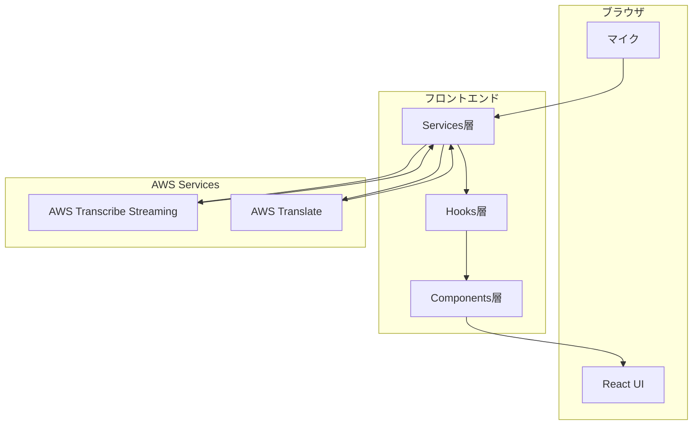
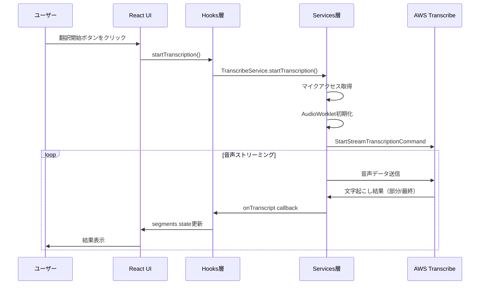
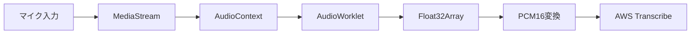

# アーキテクチャ

このドキュメントでは、アプリケーションのアーキテクチャについて説明します。

## 全体アーキテクチャ



## レイヤー構成

アプリケーションは3層アーキテクチャで構成されています。

### 1. Components層（UI表示）

ユーザーインターフェースを担当するReactコンポーネント群です。

| ファイル | 役割 |
|---------|------|
| `StandaloneTranscription.tsx` | メインコンポーネント、各機能の統合 |
| `TranscriptionResults.tsx` | 文字起こし結果の表示 |
| `TranscriptionColumn.tsx` | 日本語/英語カラムの表示 |
| `ControlButton.tsx` | 開始/停止ボタン |

### 2. Hooks層（状態管理・ビジネスロジック）

React Hooksを使用した状態管理とビジネスロジックです。

#### 文字起こし関連

| ファイル | 役割 |
|---------|------|
| `useTranscriptionService.ts` | TranscribeServiceの初期化・ライフサイクル管理 |
| `useTranscriptionControl.ts` | 開始/停止ロジック、UI状態管理 |
| `useTranscriptionSegments.ts` | 文字起こし結果（セグメント）の状態管理 |

#### 翻訳関連

| ファイル | 役割 |
|---------|------|
| `useTranslation.ts` | 翻訳処理の実行とキャッシュ管理 |

### 3. Services層（外部サービス連携）

AWSサービスとの通信を担当するサービス層です。

#### 文字起こしサービス

| ファイル | 役割 |
|---------|------|
| `transcribeService.ts` | TranscribeServiceクラス（エントリーポイント） |
| `controllers/startTranscription.ts` | 文字起こし開始処理 |
| `controllers/stopTranscription.ts` | 文字起こし停止処理 |
| `controllers/transcribeStreaming.ts` | AWS Transcribe APIとの通信 |
| `utils/audioProcessor.ts` | 音声処理（マイク取得、PCM変換） |

#### 翻訳サービス

| ファイル | 役割 |
|---------|------|
| `translateService.ts` | AWS Translate APIとの通信 |
| `translationCache.ts` | 翻訳結果のキャッシュ |

## データフロー

音声入力から文字起こし・翻訳までのデータフローです。



## コールバックパターン

Services層からHooks層への結果通知には、コールバックパターンを使用しています。

```typescript
// Hooks層でコールバックを定義
const { getService } = useTranscriptionService({
  onTranscript: (result) => {
    // 文字起こし結果を受け取ってstateを更新
  },
  onError: (error) => {
    // エラーを受け取って処理
  },
});

// Services層でコールバックを実行
callbacks.onTranscript(transcriptionResult);
```

この設計により、Services層はReactの仕組みを知らなくても、非同期で結果を返すことができます。

## 音声処理フロー



| ステップ | 説明 |
|---------|------|
| マイク入力 | `getUserMedia`でマイクアクセス |
| MediaStream | ブラウザの音声ストリーム |
| AudioContext | Web Audio APIのコンテキスト |
| AudioWorklet | 音声データのバッファリング |
| Float32Array | 浮動小数点形式の音声データ |
| PCM16変換 | AWS Transcribeが要求する形式に変換 |
| AWS Transcribe | 音声認識サービス |

## ディレクトリ構造

```
src/
├── App.tsx                      # アプリケーションルート
├── main.tsx                     # エントリーポイント
├── speech-recognition/          # 音声認識機能
│   ├── components/              # UIコンポーネント
│   │   ├── StandaloneTranscription.tsx
│   │   ├── TranscriptionResults.tsx
│   │   └── TranscriptionColumn.tsx
│   ├── hooks/                   # カスタムフック
│   │   ├── transcription/
│   │   │   ├── useTranscriptionService.ts
│   │   │   ├── useTranscriptionControl.ts
│   │   │   └── useTranscriptionSegments.ts
│   │   └── translation/
│   │       └── useTranslation.ts
│   ├── services/                # サービス層
│   │   ├── transcription/
│   │   │   ├── transcribeService.ts
│   │   │   ├── controllers/
│   │   │   │   ├── startTranscription.ts
│   │   │   │   ├── stopTranscription.ts
│   │   │   │   └── transcribeStreaming.ts
│   │   │   └── utils/
│   │   │       └── audioProcessor.ts
│   │   └── translation/
│   │       ├── translateService.ts
│   │       └── translationCache.ts
│   ├── constants/               # 定数
│   │   ├── transcription.ts
│   │   └── translation.ts
│   └── types/                   # 型定義
│       ├── transcription.ts
│       └── translation.ts
└── common/                      # 共通ユーティリティ
    ├── components/
    │   └── Button/
    │       └── ControlButton.tsx
    ├── hooks/
    │   ├── useErrorHandler.ts
    │   └── useAutoScroll.ts
    ├── constants/
    │   └── audio.ts
    └── utils/
        ├── errorMapper.ts
        └── idGenerator.ts
```
